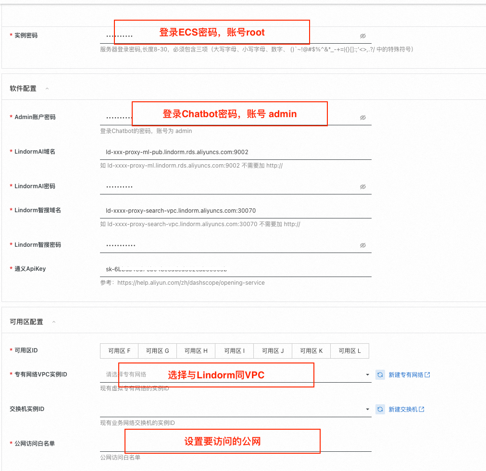

# 计算巢 lindorm+langchian文档

# 系统简介：

整体分为两个部分，一个是LLM对话，为直接对话大模型。另一个为知识库问答，用户问题先在知识库中进行近似检索，然后再把近似检索结果与问题进行Prompt再提交大模型。该系统将Langchain与Lindorm进行了深度融合，集成了LindormAl的LLM、Embedding、Rerank模型，为解决LLM模型部署较占用资源的问题，同时支持通过API Key访问通义千问的方式；集成了Lindorm的搜索与向量引擎，支持近似检索、向量文本混合检索等；支持父子文档的chunk切分与查询，提升上下文的关联性

# 计算巢一键拉起Chatbot

**前提条件**

*   开通LindormAi引擎：[https://help.aliyun.com/document\_detail/2399392.html](https://help.aliyun.com/document_detail/2399392.html?spm=a2c4g.2393245.0.i1) 集成了Embedding、Rerank模型的能力
    
*   开通Lindorm搜索与向量：[https://help.aliyun.com/document\_detail/2787357.html](https://help.aliyun.com/document_detail/2787357.html?spm=a2c4g.2787356.0.i2) 
    
*   获取Dashscope Apikey：[https://help.aliyun.com/zh/dashscope/opening-service](https://help.aliyun.com/zh/dashscope/opening-service?spm=a2c4g.11174283.0.i3)
    

LindormAI引擎与Lindorm向量实例务必选择在同一个vpc内，且将实例的白名单配置为该vpc内的网段，确保部署Chatbot的服务ECS能正确访问。 以上实例开通或配置有疑问，请提Lindorm工单，我们会拉对接群提供支持。

**开通指南：**

配置如以下截图所示。



创建成功后，登录即可, 账号是 amdin， 密码为上述软件配置设置的密码


**使用指南**

### 3.1 创建知识库设置参数：

*   是否开启混合检索：指的是向量与全文混合检索
    
*   自定义路由键：假设您有根据类似用户id查询的需求，可以使用自定义路由键功能，具备海量索引空间功能
    
*   父子文档Chunk切分：使用该功能，切分的文档更加具备上下文关联性
    


### 3.2 Rerank演示


### 3.3 父子文档演示


# 服务部署原理：

**环境需求**

1.  机型： ecs.g6 或 ecs.g7 通用机型即可
    
2.  操作系统：Ubuntu 22.04 64位
    
3.  python版本:  3.10 (上述操作系统默认python版本)
    

**前置条件**

(lindorm AI引擎、搜索引擎、向量引擎后续会统一架构 ，再用户侧看到的是一个实例)

1.  Lindorm Search与Vector引擎。
    
2.  Lindorm AI 引擎 
    
3.  DashScope API  key:   直接托管大模型，需要资源较多，且容易频繁触发服务访问超时（为保证演示服务的稳定性，暂时通过APIkey访问通义千问）
    

**依赖安装：**

1.  安装lindorm ai：pip3 intall lindormai-0.1.2-py3-none-any.whl 当前ECS内已安装
    
2.  安装langchian与集成Lindorm的插件 整体参考：当前ECS已执行
    

```shell
1. git clone git@github.com:langchain-ai/langchain.git

2. 假设位置在  /data/lindorm/soft/ 目录， 执行以下软链接
cd /data/lindorm/soft/langchain/libs/community/langchain_community/chat_models
ln -sf /data/lindorm/soft/langchain_integrations/langchain_community/chat_models/lindormai.py lindormai.py
cd /data/lindorm/soft/langchain/libs/community/langchain_community/llms
ln -sf /data/lindorm/soft/langchain_integrations/langchain_community/llms/lindormai.py lindormai.py
cd /data/lindorm/soft/langchain/libs/community/langchain_community/embeddings
ln -sf /data/lindorm/soft/langchain_integrations/langchain_community/embeddings/lindormai.py lindormai.py
cd /data/lindorm/soft/langchain/libs/community/langchain_community/document_compressors
ln -sf /data/lindorm/soft/langchain_integrations/langchain_community/document_compressors/lindormai_rerank.py lindormai_rerank.py
cd /data/lindorm/soft/langchain/libs/community/langchain_community/vectorstores
ln -sf /data/lindorm/soft/langchain_integrations/langchain_community/vectorstores/lindorm_search_store.py lindorm_search_store.py
cd /data/lindorm/soft/langchain/libs/community/langchain_community/storage
ln -sf /data/lindorm/soft/langchain_integrations/langchain_community/storage/lindorm_search_bytestore.py  lindorm_search_bytestore.py 
cd /data/lindorm/soft/langchain/libs/community/langchain_community/retrievers
ln -sf  /data/lindorm/soft/langchain_integrations/langchain_community/retrievers/lindorm_parent_document_retriever.py  lindorm_parent_document_retriever.py

3. 在langchain目录下执行如下命令将插件安装至本地：
 pip3 install -e libs/community

```

3.  安装其它python依赖
    

可以将下面依赖放在 requirements.txt 文件中，然后执行   pip3 install -r requirements.txt

```shell
pip3 install nltk==3.8.1
pip3 install gradio==3.28.3
pip3 install fastapi==0.95.0
pip3 install numpy==1.23.5
pip3 install requests~=2.28.2
pip3 install sentence-transformers
pip3 install environs
pip3 install dashscope 
pip install opensearch-py==2.6.0
```

**环境变量设置**

程序部署在 目录：/data/lindorm/langchain-ChatGLM/

编辑  /data/lindorm/langchain-ChatGLM/.env 文件

```shell
# LLM大模型，目前支持apikey与本地托管部署的方式
AI_CHAT_LLM_ENDPOINT="http://ld-xxxx-proxy-ml.lindorm.rds.aliyuncs.com:9002"
AI_CHAT_LLM_USERNAME="root"
AI_CHAT_LLM_PWD="xx"

# Embedding模型
AI_EMB_ENDPOINT="http://ld-xxxx-proxy-ml.lindorm.rds.aliyuncs.com:9002"
AI_EMB_USERNAME="root"
AI_EMB_PWD="xx"

# Rerank 模型
AI_RERANK_ENDPOINT="http://ld-xxxx-proxy-ml.lindorm.rds.aliyuncs.com:9002"
AI_RERANK_USERNAME="root"
AI_RERANK_PWD="xx"

# 搜索引擎域名，该实例必须同时包含搜索引擎与向量引擎
SEARCH_ENDPOINT="http://ld-xxxx-proxy-search-vpc.lindorm.aliyuncs.com:30070"
SEARCH_USERNAME="root"
SEARCH_PWD="xx"
```

编辑  /data/lindorm/langchain-ChatGLM/env 文件，添加 dashscope 的 api key

```shell
export DASHSCOPE_API_KEY="sk-xxxxx"
```

**程序启动**

cd /data/lindorm/langchain-ChatGLM/，日志文件为 /var/log/chat-lindorm.log

```shell
nohup ./start.sh > /var/log/chat-lindorm.log 2>&1 &
```

直接访问服务的域名为  http://公网ip:5001

\============通过以上步骤便可以访问服务,下面的步骤配置nginx与服务开机自启动==============

**配置nginx服务**

1.  安装apt install nginx
    
2.  配置代理 在  /etc/nginx/conf.d 新建  chat.conf 
    

```shell
server {
        listen       5000;
        listen       [::]:5000;
        server_name  _;
        root         /usr/share/nginx/html;

        # Load configuration files for the default server block.
        include /etc/nginx/default.d/*.conf;

        auth_basic "请输入用户和密码"; # 验证时的提示信息
        auth_basic_user_file /etc/nginx/password; # 认证文件

        location / {
          proxy_pass http://0.0.0.0:5001/;
          proxy_http_version 1.1;
          proxy_set_header Upgrade $http_upgrade;
          proxy_set_header Connection Upgrade;
        }
        error_page 404 /404.html;
        location = /404.html {
        }

        error_page 500 502 503 504 /50x.html;
        location = /50x.html {
        }
}

```

3.  设置账号密码：
    
    1.  apt install apache2-utils
        
    2.  htpasswd -bc /etc/nginx/password admin 'xxxxxxxx'
        
4.  启动nginx服务： systemctl start nginx
    
5.  设置nginx开机自启动：systemctl enable nginx
    

**配置Chatbot服务开机自启动**

1.  cd /lib/systemd/system 新建   chat-lindorm.service 
    

```shell
[Unit]
Description=ChatLindorm
After=network-online.target
Wants=network-online.target

[Service]
WorkingDirectory=/data/lindorm/langchain-ChatGLM
ExecStart=/data/lindorm/langchain-ChatGLM/start.sh
Restart=on-abnormal
StandardOutput=file:/var/log/chat-lindorm.log
StandardError=file:/var/log/chat-lindorm.log
LimitNOFILE=60000
TimeoutSec=120

[Install]
WantedBy=multi-user.target
```

2.  设置开启自启动: systemctl enable chat-lindorm